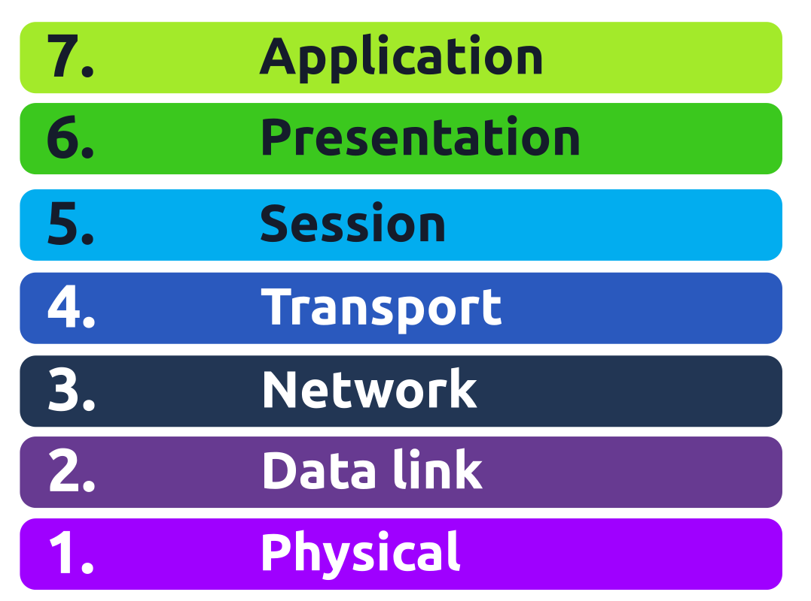

The OSI (Open Systems Interconnection) model is a conceptual model developed by the International Organization for Standardization (ISO) that describes how communications should occur in a computer network.
 The OSI model is composed of seven layers:

1. Physical Layer
2. Data Link Layer
3. Network Layer
4. Transport Layer
5. Session Layer
6. Presentation Layer
7. Application Layer
        

### Layer 1: Physical Layer

The physical layer, also referred to as layer 1, deals with the physical connection between devices; this includes the medium, such as a wire, and the definition of the binary digits 0 and 1. Data transmission can be via an electrical, optical, or wireless signal. Consequently, we need data cables or antennas, depending on our physical medium.
examples of the physical layer medium include the WiFi radio bands, the 2.4 GHz band, the 5 GHz band, and the 6 GHz band.

### Layer 2: Data Link Layer

The physical layer defines a medium to transmit our signal. The data link layer, i.e., layer 2, represents the protocol that enables data transfer between nodes on the same network segment.  The data link layer describes an agreement between the different systems on the same network segment on how to communicate. A network segment refers to a group of networked devices using a shared medium or channel for information transfer. For example, consider a company office with ten computers connected to a network switch; that’s a network segment.

Examples of layer 2 include Ethernet, i.e., 802.3, and WiFi, i.e., 802.11. Ethernet and WiFi addresses are six bytes. Their address is called a MAC address, where MAC stands for Media Access Control. They are usually expressed in hexadecimal format with a colon separating each two hexadecimal digits (one byte). The three leftmost bytes identify the vendor.
                    
                    
We expect to see two MAC addresses in each frame in real network communication over Ethernet or WiFi. The packet in the screenshot below shows:

- The destination data-link address (MAC address) highlighted in yellow
- The source data link address (MAC address) is highlighted in blue
- The remaining bits show the data being sent 
                 

### Layer 3: Network Layer

The data link layer focuses on sending data between two nodes on the same network segment. The network layer, i.e., layer 3, is concerned with sending data between different networks. In more technical terms, the network layer handles logical addressing and routing, i.e., finding a path to transfer the network packets between the diverse networks.

In the data link layer, we gave an example of one company office with ten computers, where the data link layer is responsible for providing a connection between them. Let’s say that this company has multiple offices distributed across various cities, countries, or even continents. The network layer is responsible for connecting the different offices together.

Examples of the network layer include Internet Protocol (IP), Internet Control Message Protocol (ICMP), and Virtual Private Network (VPN) protocols such as IPSec and SSL/TLS VPN.

### Layer 4: Transport Layer

Layer 4, the transport layer, enables end-to-end communication between running applications on different hosts. Your web browser is connected to the TryHackMe web server over the transport layer, which can support various functions like flow control, segmentation, and error correction.

Examples of layer 4 are Transmission Control Protocol (TCP) and User Datagram Protocol (UDP).

### Layer 5: Session Layer

The session layer is responsible for establishing, maintaining, and synchronising communication between applications running on different hosts. Establishing a session means initiating communication between applications and negotiating the necessary parameters for the session. Data synchronisation ensures that data is transmitted in the correct order and provides mechanisms for recovery in case of transmission failures.

Examples of the session layer are Network File System (NFS) and Remote Procedure Call (RPC).

### Layer 6: Presentation Layer

The presentation layer ensures the data is delivered in a form the application layer can understand. Layer 6 handles data encoding, compression, and encryption. An example of encoding is character encoding, such as ASCII or Unicode.

Various standards are used at the presentation layer. Consider the scenario where we want to send an image via email. First, we use JPEG, GIF, and PNG to save our images; furthermore, although hidden from the user by the email client, we use MIME (Multipurpose Internet Mail Extensions) to attach the file to our email. MIME encodes a binary file using 7-bit ASCII characters.

### Layer 7: Application Layer

The application layer provides network services directly to end-user applications. Your web browser would use the HTTP protocol to request a file, submit a form, or upload a file.

The application layer is the top layer, and you might have encountered many of its protocols as you use different applications. Examples of Layer 7 protocols are HTTP, FTP, DNS, POP3, SMTP, and IMAP.

| Layer Number | Layer Name         | Main Function                                         | Example Protocols and Standards           |
| ------------ | ------------------ | ----------------------------------------------------- | ----------------------------------------- |
| Layer 7      | Application layer  | Providing services and interfaces to applications     | HTTP, FTP, DNS, POP3, SMTP, IMAP          |
| Layer 6      | Presentation layer | Data encoding, encryption, and compression            | Unicode, MIME, JPEG, PNG, MPEG            |
| Layer 5      | Session layer      | Establishing, maintaining, and synchronising sessions | NFS, RPC                                  |
| Layer 4      | Transport layer    | End-to-end communication and data segmentation        | UDP, TCP                                  |
| Layer 3      | Network layer      | Logical addressing and routing between networks       | IP, ICMP, IPSec                           |
| Layer 2      | Data link layer    | Reliable data transfer between adjacent nodes         | Ethernet (802.3), WiFi (802.11)           |
| Layer 1      | Physical layer     | Physical data transmission media                      | Electrical, optical, and wireless signals |